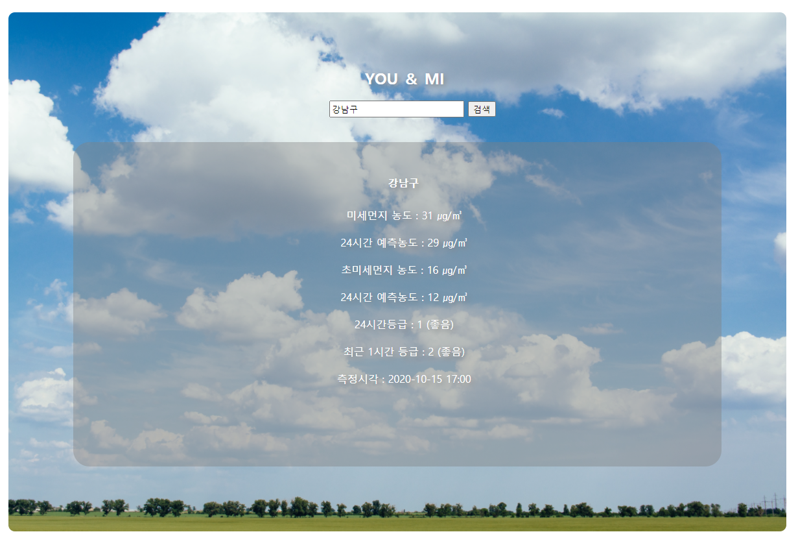

# spring_project_DAGACHI , 미세먼지 정보 보기 사이트 YOU & ME 프로젝트

## DAGACHI (단체 팀 프로젝트)

Spring을 통해 음식점 예약 사이트를 만드는 DAGACHI 프로젝트 입니다

#### 프로젝트 개요

단체인원이 식당, 음식점을 예약할 때 격는 불편함을 줄이고 쉽게 예약을 할 수 있는 사이트를 구현하기위해 제작되었습니다

#### 구현 기능 및 담당 부분

게시판을 위주로 구현 했으며 기본적인 로그안, 회원가입, 아이디 또는 비밀번호 찾기 기능과 

Mysql 을 통해 회원정보를 관리합니다

회원은 가입 후 글을 작성할 수 있으며 파일업로드, 게시글 수정, 삭제, 회원정보 수정, 댓글 등의 작업이 가능합니다

<로그인 페이지>

#### 사용 언어 및 프레임워크

Language : HTML, CSS, JSP, JAVA

Framework : Spring, Mybatis

##

## YOU & ME (개인 프로젝트)

공공데이터를 활용한 미세먼지 정보를 얻을 수 있는 단일 페이지 사이트 입니다

특정 구를 입력하면 해당 구에 맞는 미세먼지 정보 및 대기정보를 제공 받을 수 있습니다

<메인 페이지>

#### 사용 언어 및 프레임워크

Language : HTML, CSS, JSP, JAVA

Framework : Spring

