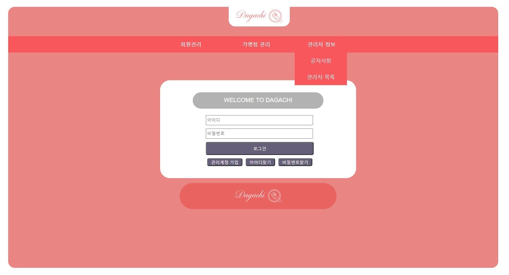

# spring_project_DAGACHI , 미세먼지 정보 보기 사이트 YOU & MI 프로젝트

## DAGACHI (단체 팀 프로젝트)

Spring을 통해 음식점 예약 사이트를 만드는 DAGACHI 프로젝트 입니다

#### 프로젝트 개요

단체인원이 식당, 음식점을 예약할 때 격는 불편함을 줄이고 쉽게 예약을 할 수 있는 사이트를 구현하기위해 제작되었습니다

#### 구현 기능 및 담당 부분

게시판 및 메인페이지, 로그인 , 댓글등의 기능을 구현 했으며 회원의 데이터는 Mysql 을 통해 관리합니다

회원은 가입 후 글을 작성할 수 있으며 그 외 파일 (업로드 , 다운로드) , 게시글 (수정, 삭제), 회원정보 (수정, 탈퇴) , 댓글 (등록 , 수정, 삭제) 등의 작업이 가능합니다

<로그인 페이지>

#### 사용 언어 및 프레임워크, 구현환경

Language : HTML, CSS, JSP, JAVA , Javascript

Framework : Spring, Mybatis

WAS : Apache Tomcat

OS : window

##

## YOU & MI (개인 프로젝트)

공공데이터를 활용한 미세먼지 정보를 얻을 수 있는 단일 페이지 사이트 입니다

특정 구를 입력하면 해당 구에 맞는 미세먼지 정보 및 대기정보를 제공 받을 수 있습니다

<메인 페이지>

#### 사용 언어 및 프레임워크, 구현환경

Language : HTML, CSS, JSP, JAVA , Javascript

Framework : Spring

WAS : Apache Tomcat

OS : window
